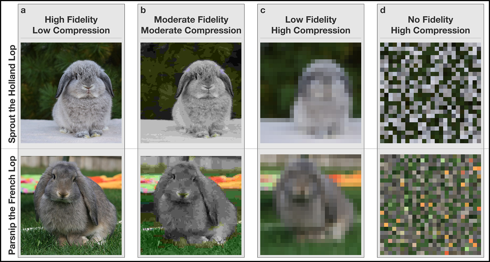

<style type="text/css">
body{ font-size: 18px; max-width: 1400px; margin: auto; padding: 1em; }
code.r{ font-size: 20px; }
p { padding-top: 8px; padding-bottom: 8px; }
pre { font-size: 16px; }
h1.title {
  font-size: 26px;
  color: Black;
}
h1 { /* Header 1 */
  font-size: 22px;
  color: DarkBlue;
}
h4 { font-size: 20px;
  color: Black;
}
h4.author { /* Author line */
  padding-top: 16px; padding-bottom: 0px;
  font-style: normal;
  font-size: 21px;
  color: Black;
}
.nobullet li {
  list-style-type: none;
  margin-top: 0.5em;
  padding-left: 5px;
  text-indent: -40px;
}
blockquote {
  display: block;
  margin-top: 1em;
  margin-bottom: 2em;
  margin-left: 40px;
  margin-right: 40px;
}
</style>

#### Department of Psychology, Penn State University

<blockquote>*Corresponding author*: Michael Hallquist, Department of Psychology, Penn State University, 140 Moore Building, University Park, PA 16801. Email: michael.hallquist@psu.edu.

*Note*. This is a longer version of a commentary that appears in the Handbook on Personality Disorders, edited by Carl Lejuez and Kim Gratz (Cambridge University Press, 2019).</blockquote>

# Introduction

Weinberg documents the history of categorical models of personality disorders (PDs) and presents a model based largely on the Diagnostic and Statistical Manual of Mental Disorders (DSM; American Psychiatric Association, 2013). He further argues that this model has notable benefits including the utility of disorder-specific concepts, which may aid in case conceptualization and treatment. The author reviews ubiquitous criticisms of the DSM model such as excessive comorbidity (Widiger & Trull, 2007) that have fueled support for dimensional and hybrid accounts of personality pathology. Indeed, despite the remarkable complexity of psychopathology, there is also structure in the patterns of symptom expression[^1] both within an individual and at the population level (Krueger & Markon, 2011). Building on this overview, we focus specifically on how taxonomic science can help clinicians and scientists navigate the often-overwhelming complexity of conceptualizing key features of an individual. 

[^1]: We note that there remains an active debate about whether symptoms or underlying mechanisms (biological, cognitive, genetic, etc.) should be the primary focus of taxonomic efforts. The central thesis of this commentary is agnostic on this point, but it is likely that both symptoms and mechanisms will be important to moving forward.

With the recent proliferation of taxonomies of psychopathology — DSM-5 Section II versus III, HiTOP (Kotov et al., 2017), RDoC (Insel et al., 2010), and other dimensional models such as the SNAP (Simms & Clark, 2006) — we believe that now is an important time to reflect on the goals of classification (cf. Blashfield & Draguns, 1976). We propose that any good[^2] taxonomy of personality pathology compresses clinical data in order to balance representational simplicity and information fidelity. To explicate this point, we draw an analogy to digital photography, which faces a similar tradeoff between file size and image fidelity. 

[^2]: We use the term “good” throughout the commentary to signify positive attributes of a taxonomic system, while acknowledging that any taxonomy provides an imperfect roadmap where information is necessarily lost.

We note that one challenge to any taxonomy is the risk of reifying the underlying distinctions it makes (Hyman, 2010). In this regard, the DSM’s categorical model of PDs assumes that diagnoses are ‘natural kinds’ despite empirical evidence that distinctions among PDs are often blurry (e.g., Zimmerman, Rothschild, & Chelminski, 2005) and the 10 DSM diagnoses may not encompass some features of personality pathology (e.g., Westen, Shedler, Durrett, Glass, & Martens, 2003). Crucially, the problem of reification can lead to a ‘taxonomy by authority’ that puts up epistemic blinders that likely impede scientific progress (Markon, 2013). With this in mind, we view the constructs used in taxonomy research as open concepts (Zachar, Turkheimer, & Shaffner, in press) that are modifiable in light of new information.

# How are clinical psychologists like digital photographers?

To set the stage for conceptualizing taxonomies of personality pathology, meet Addison, a digital photographer who was recently hired to produce a web exposé on bunnies for a pet website. Addison just finished a photoshoot and has selected 60 of the best bunny pictures. The challenge is that the design manager insists that each picture should be no more than 200 kilobytes so that the web page loads faster and does not tax server bandwidth. Addison’s original files are 30 megabytes each and contain rich visual detail, but they are 150 times larger than the acceptable size. To strike a balance between file size and image quality, she applies a ‘lossy’ JPEG compression algorithm. In lossy compression, the information in a file is compressed into fewer bits by searching for statistical dependencies in an image and removing details that do not unduly harm the fidelity of the picture. For example, subtle changes in hue from one pixel to the next could be collapsed into the same hue. As illustrated in Figure 1, by applying more severe compression, Addison can achieve smaller file sizes, but at the expense of image quality.

<br/>
<p>
```{r pressure, echo=FALSE, out.width = '100%'}

```
</p>
<blockquote>
*Figure 1.* The role of data compression and image structure in resolving differences between bunnies. Note how the fidelity of the image declines as one goes from low compression to high compression algorithms. At high compression, resolving the bunny species becomes difficult, even with prior knowledge. Importantly, the first three columns preserve the structure of the image by organizing pixels (the atomic units) in a grid structure that mimics bunnies in the real world. In the rightmost column, however, the high compression image has been randomly shuffled, destroying the perception of a bunny even though the pixels are the same. Likewise, a taxonomy that does not preserve the overall quality of the clinical picture can fail to describe psychopathology if the individual features (e.g., symptoms) are not organized in an empirically coherent fashion.
</blockquote>

Next, meet Devon, a first-year graduate student in clinical psychology conducting his first intake assessment. The client presents with a wide array of problems including binge drinking, explosive arguments with romantic partners, suicidality, frequent self-injury, and intermittent feelings of sadness and anxiety. The client also behaves flirtatiously toward Devon and says that she likes to flirt with people, but that this has led to unwanted sexual attention and even assault. Needless to say, Devon feels overwhelmed by the volume and complexity of clinical information and is now faced with writing an intake report to guide treatment planning. Like Addison, Devon is faced with the problem of how to capture the richness of the client’s experience while compressing the complexity into a simpler case formulation such as a diagnosis or personality profile. We propose that a good taxonomy can aid in this endeavor, but that without such guidance, Devon’s confusion is not due to ineptitude but to natural limitations in the representational capacity of all humans (Simon, 1956). In short, the crux of classification problems in personality pathology is, which “compression algorithm” will capture the most information about a client while not overwhelming Devon with details that could lead to suboptimal decisions influenced by cognitive heuristics? 

# Information overload and the need to compress

When provided with a large quantity of information, humans can suffer from information overload, often performing worse than simple “actuarial” decision rules (Dawes, Faust, & Meehl, 1989). Instead, decisions are often better when clinicians are provided with a few highly important pieces of information (Faust, 2012). In the face of uncertainty and complexity, humans use a number of mental heuristics that simplify decision-making, even if this leads to biased or idiosyncratic decisions (Pryor & Kriss, 1977; Tversky & Kahneman, 1974). In fact, in a complex value-based decision-making task, we found that individuals who selectively maintained a few high-value options while forgetting low-value alternatives exhibited better task performance (Hallquist & Dombrovski, 2019). In the case of psychiatric taxonomy, basic work on the limits of human representational capacity (Huys, Guitart-Masip, Dolan, & Dayan, 2015; Ma, Husain, & Bays, 2014) suggests that a good taxonomy should prune away or deemphasize peripheral information while retaining the most informative features. Thus, we propose that information compression and information fidelity are two axiomatic[^3] principles of any good taxonomy. 

[^3]: We do not use the terms “axiom” or “axiomatic” in their strict mathematical sense. Instead, we use them to emphasize necessary conditions of a good taxonomy, which we hope can help adjudicate among alternative models.

The principle of information compression is that a taxonomy should leverage the regularities in psychopathology features to emphasize dominant sources of covariation. Compression schemes may be hierarchical, as in the case of dimensional models of normal and abnormal personality, where broad distinctions such as internalizing and externalizing can be subdivided into finer features such as distress versus fear (Kotov et al., 2017; Markon, Krueger, & Watson, 2005). Although we propose that compression is an important conceptual principle, it also has formal ties to multivariate approaches such as factor analysis and cluster analysis. In factor models, a large correlation matrix is thought to reflect a smaller number of latent dimensions that explain most of the covariation. In this way, if correlations among 80 features of psychopathology can be captured by 8 latent factors, we have compressed the data tenfold, substantially simplifying the problem.

The principle of information fidelity is that a taxonomy should maintain essential features that reasonably approximate the structure of an individual or the population. Conceptually, if a taxonomy has high information fidelity, measuring a patient in terms of its features alone, one should be able to infer more detailed aspects of the clinical presentation. For example, if a patient’s medical chart contains the diagnoses of borderline personality disorder (BPD) and generalized anxiety disorder, could a clinician use this information alone to predict the patient’s level of antagonism or the likelihood of future academic struggles? Returning to factor analysis, if the compression scheme has high information fidelity, we could back-project from scores on the eight factors to estimated responses on all 80 features with reasonable accuracy. Said differently, although we necessarily sacrifice detail when we compress the features of psychopathology, a scheme with high information fidelity can still approximate these details, albeit with some imprecision.

Information compression and information fidelity are two sides of the same coin, akin to model parsimony versus fit in statistics, which are often quantified by global fit criteria derived from information theory (Burnham & Anderson, 2002; Vrieze, 2012). Importantly, the appropriate level of compression may depend on the scientific or clinical question and the evidence of incremental utility for using a less compressed (i.e., more detailed) over a more compressed (i.e., less detailed) representation. We believe that attending to the dialectical relationship between information compression and information fidelity opens a productive space for professionals to consider which taxonomy (“compression algorithm”) accomplishes the most with the fewest features.

# Judging taxonomies of personality pathology: how do we move forward? 
When choosing among different psychiatric taxonomies, we are often faced with the challenging problem of comparing systems that are qualitatively different. For example, the DSM-5’s section II model of PDs compresses 79 symptoms into 10 clinical syndromes, which can be thought of as binary variables. By contrast, the Schedule for Non-adaptive and Adaptive Personality (SNAP; Clark, 1993) compresses 375 items into 12 trait and 3 temperament dimensions. In Devon’s case, applying these taxonomies may give rather different diagnostic impressions and lead to different clinical decisions.

Using the categorical model described in DSM-5 Section II, Devon would consider whether the patient’s symptoms align with the description of a given PD diagnosis, rate the presence of 79 symptoms, sum these up for each diagnosis, and identify whether any sum exceeds the stated diagnostic threshold. This approach would likely lead to a diagnosis of BPD, given the presence of unstable relationships, labile affect, and chronic suicidality. Furthermore, the BPD diagnosis would greatly compress the clinical complexities, framing the patient’s presentation in terms of “borderlinearity”[^4] while strategically overlooking the flirtatious behavior as peripheral. As Weinberg notes, diagnostic prototypes can promote further thinking about more specific distinctions among individuals with the same diagnosis, such as the importance of interpersonal hypersensitivity in BPD (Gunderson & Lyons-Ruth, 2008). Measured by the SNAP, flirtatious behavior would be probably be represented as heightened exhibitionism, whereas the rest of patient’s presentation would be described as high levels of mistrust, aggression, and self-harm, and moderate levels of disinhibition.

[^4]: An evocative phrase borrowed from Aidan G. C. Wright.

Even though this example is intentionally simplified for illustration (i.e., the problems listed in the example are already compressed), the point is that the features that enter into case conceptualization and scientific thinking can vary widely across taxonomies (cf. Nakash, Nagar, & Westen, in press; Westen, Shedler, & Bradley, 2006). Furthermore, this example highlights the tension between a taxonomy that is reasonably comprehensive — and therefore less compressed — and one that is simple, potentially at the expense of explanatory power. Dimensional models of personality disorders have grown up in the tradition of personality psychology, which has a long history of seeking to describe a wide array of individual differences (Widiger & Mullins-Sweatt, 2009). This is an admirable approach, but there are also considerable cognitive challenges to interpreting multidimensional trait profiles (e.g., see the fascinating complexity of even two-trait combinations in Depue & Lenzenweger, 2005). For example, the Personality Inventory for DSM-5 (PID-5; Krueger, Derringer, Markon, Watson, & Skodol, 2012) contains five domains and 25 facets, representing a rich, but potentially complex, system for describing personality pathology (cf. Morey, Skodol, & Oldham, 2014). By contrast, the categorical diagnosis approach of DSM-5 Section II is probably too simplistic and narrow, as suggested by research documenting the incremental validity of personality pathology dimensions over DSM-based PD features (e.g., Evans & Simms, 2018). 

How, then, can we find the “goldilocks” just-right balance between information compression and fidelity? Part of the answer depends on a judgment of quality, which is difficult to define and open to debate (Pirsig, 1976). Returning to the quality of SNAP versus DSM perspectives on Devon’s patient, we can consider what taxonomic distinctions will best help in case conceptualization. For example, would expanding the feature space beyond “borderlinearity” alone help to mitigate over-compression? Or conversely, could the profile from the SNAP be further compressed — for example, by only focusing on extreme elevations such as mistrustfulness and self-harm — to make the complex trait profile more clinically actionable? Regardless, the compression inherent to any taxonomy should preserve the clinical picture, rather than yielding an erroneous or scrambled representation that obscures structure. This would be akin to the scrambled image in Figure 1d where the atomic features (i.e., pixels) are the same as Figure 1c, but do not aid in perceiving the bunny.

An incremental taxonomic science should also pursue an empirical path that compares the quantitative alignment of alternative models to psychopathology data. Using variants of latent variable models, personality pathology researchers can compare the relative evidence for categorical, dimensional, and hybrid taxonomies using information-theoretic fit indices (Hallquist & Wright, 2014; Krueger et al., 2018; Markon & Krueger, 2006). These criteria formally quantify the intuition that more complex models necessarily fit better, but at the expense of parsimony — echoing the tensions between fidelity and compression articulated above. Importantly, quantitatively comparing taxonomic model evidence depends on the features (i.e., variables) to be compressed being identical between models. That is, if we are to meaningfully compare classification systems, the inputs need to be the same even if the representations differ (e.g., 5 traits versus 10 categories).

In addition, to overcome debatable distinctions about quality, one clear target for advancing taxonomies of personality pathology is to compare their clinical and predictive utility. In a clinical context, a taxonomy that provides effective compression may reduce information overload, mitigating the impact of cognitive heuristics and freeing up cognitive resources to make more nuanced judgments. For example, can Devon conceptualize the client’s binge drinking, argumentativeness, and suicidality as reflecting a core problem with disinhibition? If so, this could inform treatment strategies (e.g., stimulus control) that address the shared liability. Furthermore, such a simplification could make space to help Devon think about how the client’s high SNAP exhibitionism may support a cycle in which romantic infidelity, in conjunction with disinhibition, leads to explosive arguments.

Stepping out to the nomothetic level, empirical studies of predictive utility can also advance taxonomic science. If we can agree on a set of clinical and psychological outcomes that are important to predict (e.g., suicidality or subjective well-being), then we can determine which signals are useful to retain and which can be safely compressed. For example, Eaton and colleagues (2013) found that internalizing pathology (a broad latent dimension) outperformed any DSM PD in predicting future internalizing pathology, suicide attempts, and other health-related outcomes. 

# The goal of taxonomy is to provide informative priors that guide clinical practice and inform the conceptualization of personality pathology

In summary, we propose that a good taxonomy should arm Devon with critical prior information before interviewing his client. This is an idea borrowed from Bayesian decision theory (Berger, 1993), in which decision-makers bring prior information to bear on current decisions, thus potentially reducing uncertainty and focusing attention on key variables. Priors in psychiatric description should provide an empirically based roadmap to make predictions when faced with uncertain information, rather than promoting reification or encouraging overreliance on clinical experience.

In psychopathology, clinicians often operate with noisy information such as brief psychiatric interviews, analogous to the highly compressed bunny pictures in Figure 1c. Upon first glance, one may be able to discern that the top and bottom panels are both bunnies, but few could predict the breed. However, if one were told that French Lops have longer ears than Holland Lops, whereas Holland Lops have faces that are rounder, one could more easily focus on the pixels in the images that pertain to this discrimination. Likewise, a good taxonomy should provide prior information about what features are important to focus on when working with compressed or limited data. Indeed, a sizable literature has documented that personality pathology is often overlooked in clinical assessments because key features are not systematically assessed or emphasized (e.g., Ruggero, Zimmerman, Chelminski, & Young, 2010). Furthermore, population norms for personality pathology assessments can provide crucial information about the rarity of a trait elevation in a given patient. Such norms would help Devon to incorporate base rates into clinical judgment, a classic example of how prior information can lead to more accurate decisions (Meehl & Rosen, 1955).

In short, informative priors can help professionals organize the vast amount of data contained in a clinical presentation and learn to allocate their cognitive resources to important distinctions (cf. Lieder, Shenhav, Musslick, & Griffiths, 2018). Ideally, a taxonomy should provide Devon with highly compressed information shaped by empirical evidence, allowing him to make well-informed clinical decisions without inundating him with specifics. Importantly, priors necessarily bias predictions, but taxonomic science should strive to provide priors that bias clinicians toward good decisions (Hertwig & Grüne-Yanoff, 2017).

By emphasizing information compression and information fidelity as two “axiomatic” principles of a good taxonomy, we hope to promote further discussion among advocates of different models of personality pathology. If disparate taxonomies can be judged on similar criteria and compared using quantitative methods that address the parsimony-fit tradeoff, this will spark productive discourse and motivate incremental progress in the classification of personality pathology. Ultimately, a taxonomy that provides empirically supported informative priors can maximize the system’s utility in both clinical science and practice.

# References

<div class="nobullet">
* American Psychiatric Association. (2013). Diagnostic and Statistical Manual of Mental Disorders: DSM-5 (5th ed.). Washington, D.C: American Psychiatric Publishing.
* Berger, J. O. (1993). Statistical Decision Theory and Bayesian Analysis (2nd edition). New York: Springer.
* Blashfield, R. K., & Draguns, J. G. (1976). Toward a Taxonomy of Psychopathology: The Purpose of Psychiatric Classification. The British Journal of Psychiatry, 129(6), 574–583. https://doi.org/10.1192/bjp.129.6.574
* Burnham, K. P., & Anderson, D. R. (2002). Model selection and multi-model inference: A practical information-theoretic approach (2nd ed.). New York: Springer.
* Clark, L. . (1993). Manual for the Schedule for Nonadaptive and Adaptive Personality (SNAP). Minneapolis: University of Minnesota Press.
* Dawes, R. M., Faust, D., & Meehl, P. E. (1989). Clinical versus actuarial judgment. Science, 243(4899), 1668–1674. https://doi.org/10.1126/science.2648573
* Depue, R. A., & Lenzenweger, M. F. (2005). A neurobehavioral dimensional model of personality disturbance. In J. F. Clarkin & M. F. Lenzenweger (Eds.), Major theories of personality disorder (2nd ed., pp. 391–453). New York, NY: Guilford Press.
* Eaton, N. R., Krueger, R. F., Keyes, K. M., Wall, M., Hasin, D. S., Markon, K. E., … Grant, B. F. (2013). The Structure and Predictive Validity of the Internalizing Disorders. Journal of Abnormal Psychology, 122(1), 86–92. https://doi.org/10.1037/a0029598
* Evans, C. M., & Simms, L. J. (2018). Assessing inter-model continuity between the Section II and Section III conceptualizations of borderline personality disorder in DSM–5. Personality Disorders: Theory, Research, and Treatment, 9(3), 290–296. https://doi.org/10.1037/per0000243
* Faust, D. (2012). Decision Research Can Increase the Accuracy of Clinical Judgment and Thereby Improve Patient Care. In S. O. Lilienfeld & W. T. O’Donohue (Eds.), The Great Ideas of Clinical Science (pp. 49–76). New York, NY: Routledge. https://doi.org/10.4324/9780203942789-10
* Gunderson, J. G., & Lyons-Ruth, K. (2008). BPD’s Interpersonal Hypersensitivity Phenotype: A Gene-Environment-Developmental Model. Journal of Personality Disorders, 22(1), 22–41. https://doi.org/10.1521/pedi.2008.22.1.22
* Hallquist, M. N., & Dombrovski, A. Y. (2019). Selective maintenance of value information helps resolve the exploration/exploitation dilemma. Cognition, 183, 226–243. https://doi.org/10.1016/j.cognition.2018.11.004
* Hallquist, M. N., & Wright, A. G. C. (2014). Mixture modeling in the assessment of normal and abnormal personality: I – Cross-sectional models. Journal of Personality Assessment, 96, 256–268.
* Hertwig, R., & Grüne-Yanoff, T. (2017). Nudging and Boosting: Steering or Empowering Good Decisions. Perspectives on Psychological Science, 12(6), 973–986. https://doi.org/10.1177/1745691617702496
* Huys, Q. J. M., Guitart-Masip, M., Dolan, R. J., & Dayan, P. (2015). Decision-Theoretic Psychiatry. Clinical Psychological Science, 2167702614562040. https://doi.org/10.1177/2167702614562040
* Insel, T., Cuthbert, B., Garvey, M., Heinssen, R., Pine, D. S., Quinn, K., … Wang, P. (2010). Research Domain Criteria (RDoC): Toward a New Classification Framework for Research on Mental Disorders. American Journal of Psychiatry, 167(7), 748–751. https://doi.org/10.1176/appi.ajp.2010.09091379
* Kotov, R., Krueger, R. F., Watson, D., Achenbach, T. M., Althoff, R. R., Bagby, R. M., … Zimmerman, M. (2017). The Hierarchical Taxonomy of Psychopathology (HiTOP): A dimensional alternative to traditional nosologies. Journal of Abnormal Psychology, 126(4), 454–477. http://dx.doi.org/10.1037/abn0000258
* Krueger, R. F., Derringer, J., Markon, K. E., Watson, D., & Skodol, A. E. (2012). Initial Construction of a Maladaptive Personality Trait Model and Inventory for DSM-5. Psychological Medicine, 42(9), 1879–1890. https://doi.org/10.1017/S0033291711002674
* Krueger, R. F., Kotov, R., Watson, D., Forbes, M. K., Eaton, N. R., Ruggero, C. J., … Zimmermann, J. (2018). Progress in achieving quantitative classification of psychopathology. World Psychiatry, 17(3), 282–293. https://doi.org/10.1002/wps.20566
* Krueger, R. F., & Markon, K. E. (2011). A dimensional-spectrum model of psychopathology: Progress and opportunities. Archives of General Psychiatry, 68(1), 10–11. https://doi.org/10.1001/archgenpsychiatry.2010.188
* Lieder, F., Shenhav, A., Musslick, S., & Griffiths, T. L. (2018). Rational metareasoning and the plasticity of cognitive control. PLOS Computational Biology, 14(4), e1006043. https://doi.org/10.1371/journal.pcbi.1006043
* Ma, W. J., Husain, M., & Bays, P. M. (2014). Changing concepts of working memory. Nature Neuroscience, 17(3), 347–356. https://doi.org/10.1038/nn.3655
* Markon, K. E. (2013). Epistemological pluralism and scientific development: an argument against authoritative nosologies. Journal of Personality Disorders, 27(5), 554–579. https://doi.org/10.1521/pedi.2013.27.5.554
* Markon, K. E., & Krueger, R. F. (2006). Information-theoretic latent distribution modeling: Distinguishing discrete and continuous latent variable models. Psychological Methods, 11(3), 228–243.
* Markon, K. E., Krueger, R. F., & Watson, D. (2005). Delineating the structure of normal and abnormal personality: an integrative hierarchical approach. Journal of Personality and Social Psychology, 88(1), 139–157.
* Meehl, P. E., & Rosen, A. (1955). Antecedent probability and the efficiency of psychometric signs, patterns, or cutting scores. Psychological Bulletin, 52(3), 194–216. https://doi.org/10.1037/h0048070
* Morey, L. C., Skodol, A. E., & Oldham, J. M. (2014). Clinician judgments of clinical utility: A comparison of DSM-IV-TR personality disorders and the alternative model for DSM-5 personality disorders. Journal of Abnormal Psychology, 123(2), 398–405. http://dx.doi.org.ezaccess.libraries.psu.edu/10.1037/a0036481
* Nakash, O., Nagar, M., & Westen, D. (in press). Validity and clinical utility of DSM and empirically derived prototype diagnosis for personality disorders in predicting adaptive functioning. Personality Disorders: Theory, Research, and Treatment. https://doi.org/10.1037/per0000293
* Pirsig, R. M. (1976). Zen and the Art of Motorcycle Maintenance : An Inquiry Into Values. Bantam.
* Pryor, J. B., & Kriss, M. (1977). The Cognitive Dynamics of Salience in the Attribution Process. Journal of Personality and Social Psychology; Washington, D.C., 35(1), 49.
* Ruggero, C. J., Zimmerman, M., Chelminski, I., & Young, D. (2010). Borderline personality disorder and the misdiagnosis of bipolar disorder. Journal of Psychiatric Research, 44(6), 405–408. https://doi.org/10.1016/j.jpsychires.2009.09.011
* Simms, L. J., & Clark, L. A. (2006). The Schedule for Nonadaptive and Adaptive Personality (SNAP): A dimensional measure of traits relevant to personality and personality pathology. In S. Strack (Ed.), Differentiating normal and abnormal personality (2nd ed., pp. 431–450). New York, NY: Springer Publishing.
* Simon, H. A. (1956). Rational choice and the structure of the environment. Psychological Review, 63(2), 129–138.
* Tversky, A., & Kahneman, D. (1974). Judgment under Uncertainty: Heuristics and Biases. Science, 185(4157), 1124–1131. https://doi.org/10.1126/science.185.4157.1124
* Vrieze, S. I. (2012). Model selection and psychological theory: a discussion of the differences between the Akaike information criterion (AIC) and the Bayesian information criterion (BIC). Psychological Methods, 17(2), 228–243. https://doi.org/10.1037/a0027127
* Westen, D., Shedler, J., & Bradley, R. (2006). A prototype approach to personality disorder diagnosis. American Journal of Psychiatry. Retrieved from http://ajp.psychiatryonline.org/doi/pdf/10.1176/ajp.2006.163.5.846
* Westen, D., Shedler, J., Durrett, C., Glass, S., & Martens, A. (2003). Personality diagnoses in adolescence: DSM-IV axis II diagnoses and an empirically derived alternative. The American Journal of Psychiatry, 160(5), 952–966.
* Widiger, T. A., & Mullins-Sweatt, S. N. (2009). Five-Factor Model of Personality Disorder: A Proposal for DSM-V. Annual Review of Clinical Psychology, 5(1), 197–220. https://doi.org/10.1146/annurev.clinpsy.032408.153542
* Widiger, T. A., & Trull, T. J. (2007). Plate tectonics in the classification of personality disorder: Shifting to a dimensional model. American Psychologist, 62(2), 71–83.
* Zachar, P., Turkheimer, E., & Shaffner, K. (in press). Defining and Redefining Phenotypes: Operational Definitions as Open Concepts. In A. G. C. Wright & M. N. Hallquist (Eds.), Handbook of Research Methods in Clinical Psychology. Cambridge, UK: Cambridge University Press.
* Zimmerman, M., Rothschild, L., & Chelminski, I. (2005). The Prevalence of DSM-IV Personality Disorders in Psychiatric Outpatients. American Journal of Psychiatry, 162(10), 1911–1918. https://doi.org/10.1176/appi.ajp.162.10.1911
</div>


